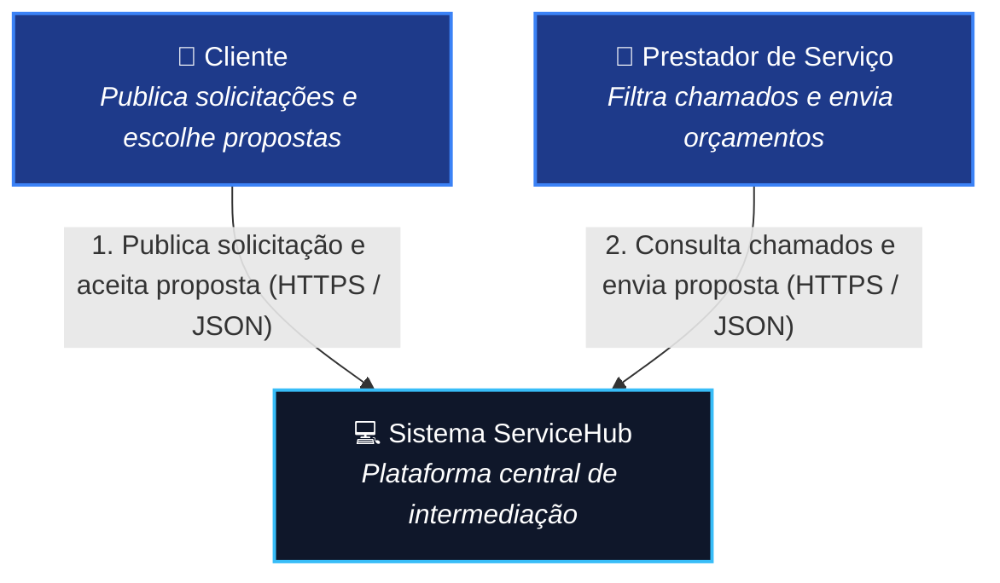

```mermaid
graph TB
    classDef person fill:#1e3a8a,stroke:#3b82f6,stroke-width:2px,color:#ffffff;
    classDef system fill:#0f172a,stroke:#38bdf8,stroke-width:2px,color:#ffffff;

    Cliente["👤 Cliente<br/><i>Publica solicitações e escolhe propostas</i>"]:::person
    Prestador["👤 Prestador de Serviço<br/><i>Filtra chamados e envia orçamentos</i>"]:::person
    ServiceHub["💻 Sistema ServiceHub<br/><i>Plataforma central de intermediação</i>"]:::system

    Cliente -->|"1. Publica solicitação e aceita proposta (HTTPS / JSON)"| ServiceHub
    Prestador -->|"2. Consulta chamados e envia proposta (HTTPS / JSON)"| ServiceHub
```