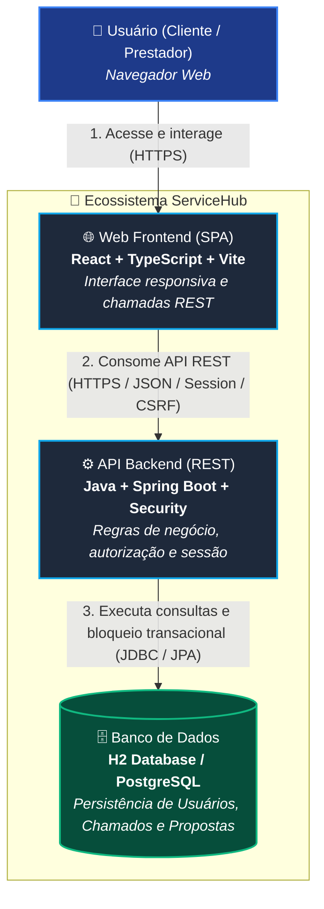

```mermaid
    graph TB
    classDef person fill:#1e3a8a,stroke:#3b82f6,stroke-width:2px,color:#ffffff;
    classDef container fill:#1e293b,stroke:#0ea5e9,stroke-width:2px,color:#ffffff;
    classDef db fill:#064e3b,stroke:#10b981,stroke-width:2px,color:#ffffff;

    Usuario["👤 Usuário (Cliente / Prestador)<br/><i>Navegador Web</i>"]:::person

    subgraph Ecossistema[" 🏢 Ecossistema ServiceHub "]
        Frontend["🌐 Web Frontend (SPA)<br/><b>React + TypeScript + Vite</b><br/><i>Interface responsiva e chamadas REST</i>"]:::container
        Backend["⚙️ API Backend (REST)<br/><b>Java + Spring Boot + Security</b><br/><i>Regras de negócio, autorização e sessão</i>"]:::container
        Database[("🗄️ Banco de Dados<br/><b>H2 Database / PostgreSQL</b><br/><i>Persistência de Usuários, Chamados e Propostas</i>")]:::db
    end

    Usuario -->|"1. Acesse e interage (HTTPS)"| Frontend
    Frontend -->|"2. Consome API REST (HTTPS / JSON / Session / CSRF)"| Backend
    Backend -->|"3. Executa consultas e bloqueio transacional (JDBC / JPA)"| Database
```